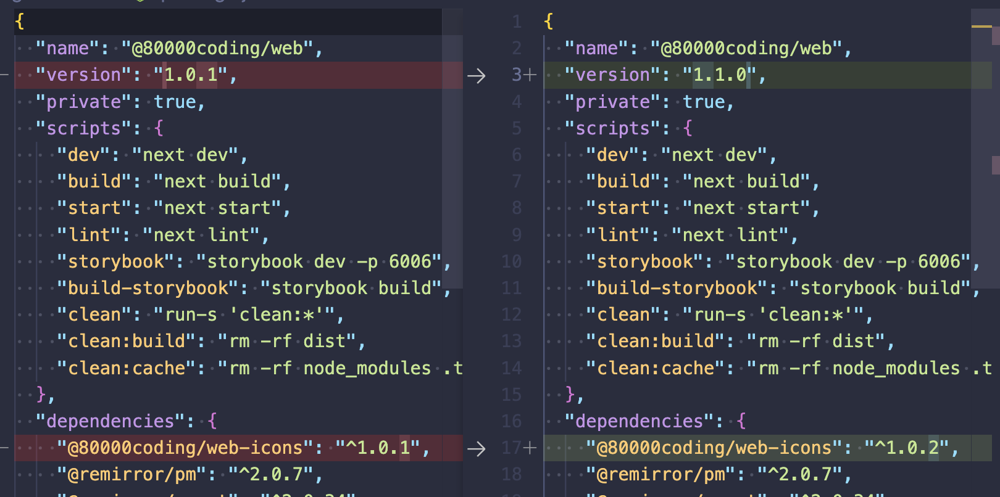

# 80000Coding-Web-Client

팔만코딩경 Web Client 레포지토리 입니다.

# 패키지 구조

```shell
.
├── LICENSE
├── README.md
├── package-lock.json
├── package.json
├── packages
│   ├── web            # next-js client
│   └── web-icons      # icon library
├── prettier.config.js
└── turbo.json
```

# Changesets Usage

아래는 간단한 cli 명령어 사용법입니다.
더 자세한 내용은 [링크](https://github.com/changesets/changesets/blob/main/packages/cli/README.md)를 참고해주세요.

```shell
# dependencies 설치
npm install

# 변경사항 확인
npx changeset status

# 변경사항 추가
npx changeset
```

### 변경사항 추가 예시

1. 변경사항을 포함할 packages를 선택합니다 (여러개 선택 가능)
2. space 키을 사용해 선택 후, return 키로 다음으로 넘어갑니다.
3. major, minor, patch 중 선택 합니다.

```json
/**
 * major, minor, patch는 아래와 같은 의미를 가집니다.
 * ex) 버전이 1.0.0일 때,
 * ㄴ major는 2.0.0,
 * ㄴ minor는 1.1.0,
 * ㄴ patch는 1.0.1이 됩니다.
 */
{
  "name": "80000coding",
  "version": "1.0.0"
  //          | | |
  //          | | └-- patch
  //          | └---- minor
  //          └------ major
}
```

4. 변경사항에 대한 결과가 md 파일로 생성됩니다

```shell
# .changeset/{changeset-id}.md
# 각 패키지의 변경사항 및 Summary를 확인할 수 있습니다.
# 해당 파일에서 Summary를 직접 수정할 수 있습니다.
---
'@80000coding/web': minor
'@80000coding/web-icons': patch
---

minor bump
```

5. 변경사항을 적용합니다.

```shell
npx changeset version
```

위 명령을 사용하면 변경사항이 실제 패키지에 적용됩니다. 각 패키지에 CHANGELOG.md 파일이 생성되며, 변경 사항이 추가됩니다.

```md
# @80000coding/web

## 1.1.0 <- 이 위치에 버전이 추가됩니다

### Minor Changes

- minor bump <- 이 위치에 Summary가 추가됩니다

### Patch Changes

- Updated dependencies
  - @80000coding/web-icons@1.0.2
```

또한 package.json 파일에 명시해둔 버전이 변경됩니다. 의존성이 있는 패키지의 버전이 수정된 경우에도 변경사항이 적용됩니다.



6. 변경사항을 커밋, 푸시합니다.
7. PR을 생성하고 머지되면 변경사항이 최종적으로 적용됩니다.

### Automation

현재 Changesets Github Bot과 Gihtub Actions이 등록되어있습니다. 각 도구별 기능은 아래와 같습니다. ❌ 표시가 된 기능은 아직 적용하지 않았습니다.

- Changesets Github Bot

  - 현재 PR에 Changeset 이 적용되어있는지 확인
  - Changeset이 적용되어 있지 않은 PR에 Github에서 바로 추가할 수 있는 기능 제공

- Github Actions
  - PR이 머지되면 자동으로 버전을 업데이트하고, 변경사항을 새로운 PR로 생성 - [예시](https://github.com/80000Coding/80000Coding-Web-Client/pull/73)
  - ❌ 버전이 업데이트되면 자동으로 Github Release를 생성
  - ❌ Github Release가 생성되면 자동으로 NPM에 배포

Github Action을 사용하려면 `npx changeset`명령 까지만 실행한 후, PR을 생성하면 됩니다. 혹은 Gihthub에서 Changeset Github Bot을 활용해 GUI로 직접 추가할 수 있습니다.
